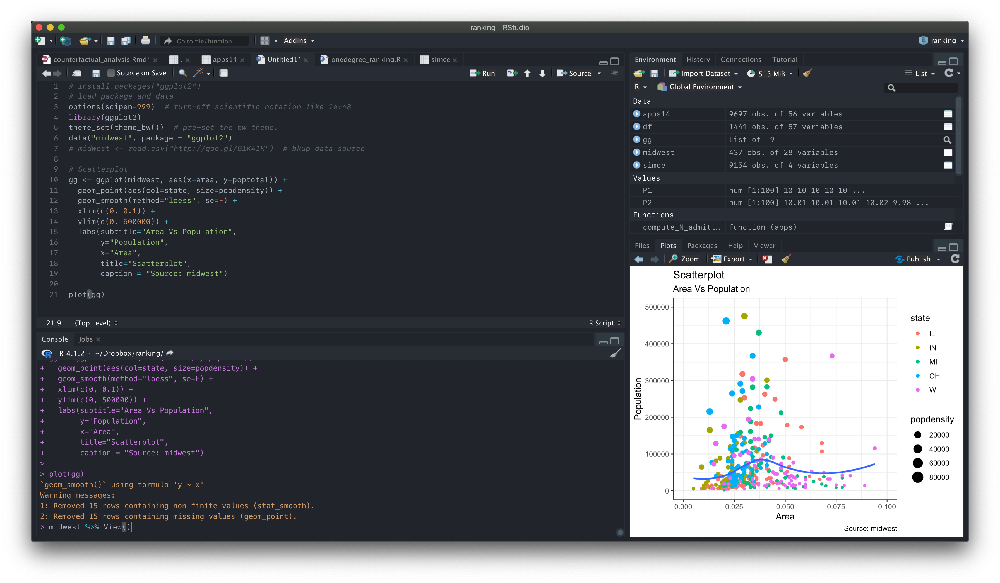

# One Dark Pro for RStudio


A 'Total IDE' build of the One Dark Pro theme for RStudio!

This is a fork of [github.com/johnnybarrels/rstudio-one-dark-pro-theme](https://github.com/johnnybarrels/rstudio-one-dark-pro-theme).
The reason why I created this fork is mostly aesthetics: some menus had ugly (i.e. white) backgrounds that stuck out in this otherwise dark theme, and sometimes even made text unreadable.
I upvoted this issue and created a PR to fix it, but the repo appears unmaintained.
Therefore, I took it into my own hands to implement and maintain these fixes.

## Installation

**FIRST**: In RStudio, go to Global Options -> Appearance and ensure either `Modern` or `Sky` are selected as the `RStudio Theme` at the top

### Automatic

Run the following snippet in the RStudio Console:

```r
rstudioapi::addTheme('https://raw.githubusercontent.com/acarril/rstudio-one-dark-pro-theme/master/OneDarkPro.rstheme', apply=TRUE, force=TRUE)
```

Note that this will override any other theme named 'One Dark Pro' you may have (this can be controlled by removing the `force=True` argument).

If you get the error:
```rr
Error in loadNamespace(name) : there is no package called 'rstudioapi'
```
run `install.packages('rstudioapi')` and try again.

### Manual

- Download the `OneDarkPro.rstheme` file from this repository (or clone)
- In RStudio go to Global Options -> Appearance, and click the `Add...` button under Editor Theme
- Navigate to the downloaded `OneDarkPro.rstheme` file, hit `Open` and you're good to go

## Info

This theme was adapted from [this theme](https://github.com/patrickshox/Mojave-Dark-RStudio-Theme), many thanks to Patrick for working out how to theme more than just the code editor in RStudio!

**Note**: There can be versioning issues with some of the various UI components (different item class codes etc). These usually present themselves as parts of the UI with white text on a white background. If you do run into any UI issues, feel free to look through the issues listed [here](https://github.com/johnnybarrels/rstudio-one-dark-pro-theme/issues) or create a new one for me to take a look at.

This theme has been tested and is fully functional on:
```
macOS Catalina 10.1576, RStudio 2021.09.2+382 "Ghost Orchid" Release (fc9e217980ee9320126e33cdf334d4f4e105dc4f, 2022-01-04)
```
and
```
Windows 10, RStudio 1.2.5033
```

The editor font I use is [Fira Code](https://github.com/tonsky/FiraCode), and the majority of the UI font is [Open Sans](https://fonts.google.com/specimen/Open+Sans). It is not necessary to install these.

If you have any suggested improvements, let me know [here](https://github.com/acarril/rstudio-one-dark-pro-theme/issues)!
